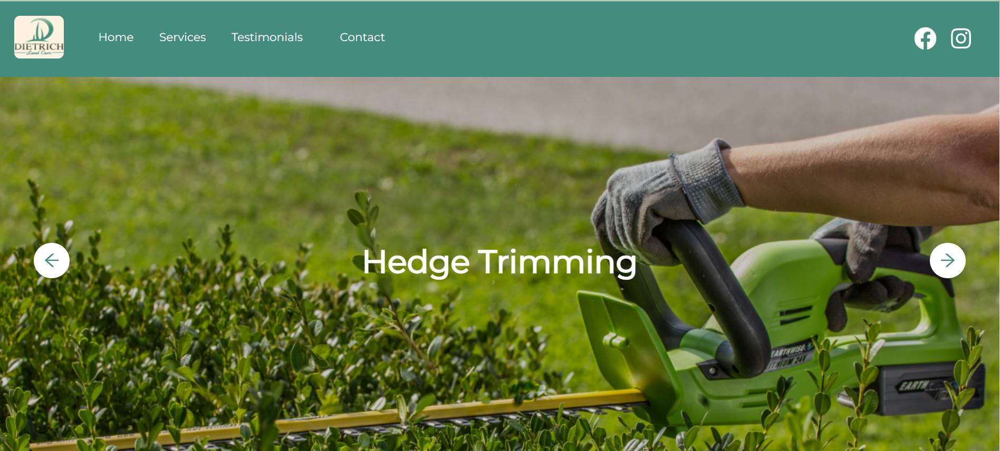
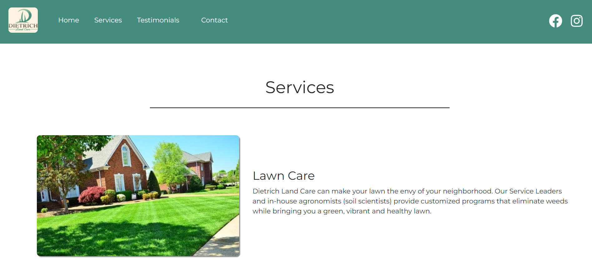
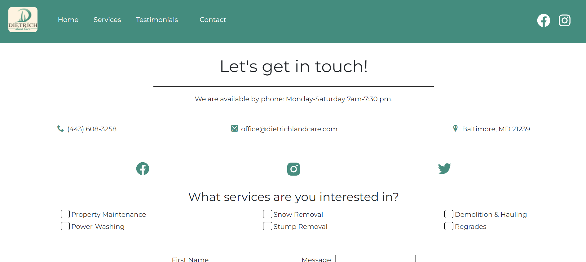

# Dietrich Landcare

  
  
  
  

  

My oldest son needed a website for his landscaping business so here it is. For
this project I used NextJS with Object Oriented Programming. I used Bootstrap for
the CSS framework and the EmailJS library for the contact functionality.

- **Documentation:**
    - [NextJS](https://nextjs.org/)  
    - [Bootstrap](https://getbootstrap.com/docs/5.0)
    - [MongoDB](https://www.mongodb.com/)
    - [EmailJS](https://www.emailjs.com/)
  

## How To Run This Project

1. Install NodeJS version 16 or later
2. Clone project (in terminal add `git clone https://github.com/ChrisDietrich405/dietrich-landcare-next`)
3. Install dependencies (in terminal run `npm install`)
4. Run project (in terminal run `npm start`)

Open [http://localhost:3000](http://localhost:3000) to view it in the browser.

## Screenshots

Home Page

Services Page

Contact Page

=======

